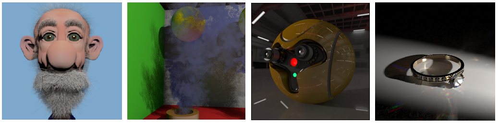

# Multifragment Rendering

## Overview

Multifragment rendering (MFR) is a genre of image synthesis techniques and associated data structures tightly coupled with the rasterisation pipeline, which has helped deliver important improvements to the visual quality of primitive-order rendering and has enabled the real-time display of complex phenomena and structures. An MFR method encompasses the algorithms and image-space data structures that are necessary to produce, maintain, process and exploit a set of geometry fragments that are associated with a single image, in the sense that multiple samples correspond to the same location in image space.

The main advantage of these approaches is that they encompass additional rasterised geometry, by retaining more information from the fragment sampling domain, thus augmenting the visibility determination stage.

**Figure 1.** Multifragment rendering has been deployed in a wide spectrum of rendering applications in order to generate compelling graphics effects at interactive frame rates.

### Table of Contents

- [Aim](#Aim)
- [Downloads](#Downloads)
- [How to Cite](#How-to-Cite)

## Aim

The goals of this github account are: 
- Present formally the MFR pipeline, identifying the construction strategies, image operation categories and
their mapping to the respective applications.
- Offer publications and multimedia content related to the MFR research area.
- Provide several open source projects that examine the underlying construction mechanisms of MFR solutions and their applications, ranging from order-independent transparency to global illumination. (TBD)

## Pipeline

(TBD)

## Downloads

### Research Achievements (from 2015 to now)

**2020**
- Evangelou I., Papaioannou G., Vardis A., Vasilakis A. A., '_Rasterization-based Progressive Photon Mapping_', _conditionally accepted_ at The Visual Computer (CGI'2020 Special Issue). 

- Vasilakis A. A., Vardis A., Papaioannou G., '_A Survey of Multifragment Rendering_', Computer Graphics Forum (Eurographics 2020 - STAR Papers). 

**2017**

- Vasilakis A. A., Vardis A., Papaioannou G. and Moustakas K.,'_Variable k-buffer using Importance Maps_', Eurographics 2017 - Short Papers.

**2016**

-  Vardis K., Vasilakis A. A., Papaioannou G., '_DIRT: Deferred Image-based Ray Tracing_', High-Performance Graphics 2016.
-  Vardis K., Vasilakis A. A., Papaioannou G., '_A Multiview and Multilayer Approach for Interactive Ray Tracing_', Interactive 3D Graphics and Games 2016.

**2015**

-  Vasilakis A. A., Papaioannou G., Fudos I. '_k+-buffer: An efficient, memory-friendly and dynamic k-buffer framework_', IEEE TVCG, 2015.
-  Vasilakis A. A., Papaioannou G., '_Improving k-buffer methods via Occupancy Maps_', Eurographics 2015 - Short Papers.

### GLSL Source Code

A comprehensive shader source code bundle for efficiently solving the visibility determination problem in screen space, a fundamental task for many image-based and frame buffer techniques, including complex rendering effects like order-independent-transparency, CSG rendering and collision detection.

This extensive collection includes the most widely-used multi-fragment rendering solutions such as  the depth peeling variants as well as k-buffer and A-buffer alternatives. The source code is mainly written using the OpenGL 4.4 API, except from the parts that do not require GPU-accelerated atomic memory operations (OpenGL 3.3).

### Demos

(TBD)

## How to Cite

### LaTeX and BibTeX example usage

<blockquote>
<pre style="white-space:pre-wrap; word-wrap:break-word;
">
In our work, we have used the shader source code~\cite{VVP_EG_2020_STAR}, available at <em>'https://github.com/cgaueb/MFR'</em> repository.
</pre>

<pre style="white-space:pre-wrap; word-wrap:break-word;">
@journal{VVP_EG_2020_STAR,
    title   = {A Survey of Multifragment Rendering},
    author  = {Vasilakis, Andreas Alexandros and Vardis, Konstantinos and Papaioannou, Georgios},
    journal = {Computer Graphics Forum},
    volume  = {39},
    number  = {2},
    pages   = {?-?},
    year    = {2020},
    doi     = {TBD},
    url     = {TBD},
    eprint  = {TBD}
}
      
</pre>

</blockquote>