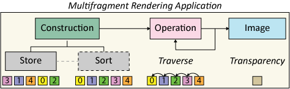

# Multifragment Rendering

## Overview

Multifragment rendering (MFR) is a genre of image synthesis techniques and associated data structures tightly coupled with the rasterisation pipeline, which has helped deliver important improvements to the visual quality of primitive-order rendering and has enabled the real-time display of complex phenomena and structures. An MFR method encompasses the algorithms and image-space data structures that are necessary to produce, maintain, process and exploit a set of geometry fragments that are associated with a single image, in the sense that multiple samples correspond to the same location in image space.

The main advantage of these approaches is that they encompass additional rasterised geometry, by retaining more information from the fragment sampling domain, thus augmenting the visibility determination stage. For more details, please refer to the recent <a href="Multimedia\EG2020_STAR_paper.pdf"> state-of-the-art report </a> which was accepted at the Eurographics 2020 conference. 

**Figure 1.** Multifragment rendering has been deployed in a wide spectrum of rendering applications in order to generate compelling graphics effects at interactive frame rates.

### Table of Contents

- [Aim](#Aim)
- [Pipeline](#Pipeline)
- [Downloads](#Downloads)
- [How to Cite](#How-to-Cite)
- [References](#References)

## Aim

The goals of this github repository are to:
- Present formally the MFR pipeline.
- Offer a centralised location that contains source code and examples of the MFR-related research that has been done by the [CG AUEB Group](http://graphics.cs.aueb.gr).
- Provide a generalised MFR framework for prototyping constructions methodologies and their applications, ranging from order-independent transparency to global illumination and data visualisation. (TBD)

## Pipeline

At a conceptual level, the complex primary visibility determination is part of a more general multifragment pipeline responsible for generating, storing, processing and evaluating information from incoming fragments. This pipeline is comprised of three main steps: _construction_, _operation_ and _image composition_, which are defined by the context of the particular _application_ in mind. The _construction_ step is responsible for generating and storing per-pixel fragments through a common rasterisation procedure. Even though _storing_ and _sorting_ are two fundamental building blocks of the construction step, the latter stage is implicitly or explicitly performed. After construction has taken place, the next step performs one or more _operations_ on the ordered fragment data structure. Finally, the _application_ accesses and exploits the fragment information stored in the MFR structure to compose the final output.

## Downloads

### GLSL Source Code

A comprehensive shader source code bundle for efficiently solving the visibility determination problem in screen space is provided. This extensive collection includes the most widely-used multi-fragment rendering solutions such as the depth peeling variants as well as k-buffer and A-buffer alternatives. The source code is mainly written using the OpenGL 4.4 API, except from the parts that do not require GPU-accelerated atomic memory operations (OpenGL 3.3).

#### Data Structures
|  Name/Location | Description | Citation |
| ---   | ---      | ---         |
| **Depth Peeling** ([*ZIP* file](Sources/depth_peeling.zip))||
| [F2B](Sources/MFR/shaders/source)     | Front-to-back | [Eve01](#[Eve01]) |
| **k-buffer** ([*ZIP* file](Sources/k-buffer.zip))||
| [KB](Sources/MFR/shaders/source)      | K-buffer      | [BCL*07](#[BCL*07]) |
| **A-Buffer** ([*ZIP* file](Sources/A-buffer.zip))||
| [AB-LL](Sources/MFR/shaders/source)   | Linked-List   | [YHG*10](#[YHG*10]) |
| **ALL** ([*ZIP* file](Sources/sources.zip))|

#### Sorting Solutions
|  Location | Description | Citation |
|  --- | --- | --- |
| [Sort local](Sources/MFR/shaders/source) |Sort local | [YHG*10](#[YHG*10]) |

### Demos

(TBD)

### Research Content

- Evangelou I., Papaioannou G., Vardis K., Vasilakis A. A., '_Rasterization-based Progressive Photon Mapping_', _conditionally accepted_ at The Visual Computer (CGI'2020 Special Issue). 
- Vasilakis A. A., Vardis K., Papaioannou G., '_A Survey of Multifragment Rendering_', Computer Graphics Forum (Eurographics 2020 - STAR Papers). 

- Vasilakis A. A., Vardis K., Papaioannou G. and Moustakas K.,'_Variable k-buffer using Importance Maps_', Eurographics 2017 - Short Papers.  

-  Vardis K., Vasilakis A. A., Papaioannou G., '_DIRT: Deferred Image-based Ray Tracing_', High-Performance Graphics 2016.

-  Vardis K., Vasilakis A. A., Papaioannou G., '_A Multiview and Multilayer Approach for Interactive Ray Tracing_', Interactive 3D Graphics and Games 2016.   
-  Vasilakis A. A., Papaioannou G., Fudos I. '_k+-buffer: An efficient, memory-friendly and dynamic k-buffer framework_', IEEE TVCG, 2015. 
-  Vasilakis A. A., Papaioannou G., '_Improving k-buffer methods via Occupancy Maps_', Eurographics 2015 - Short Papers.  

## How to Cite
The license is [MIT](LICENSE). If you use the contents of this repository for your work, pleace cite it as described below:

### LaTeX and BibTeX example usage

<blockquote>
<pre style="white-space:pre-wrap;">
In our work, we have used the shader source code~\cite{VVP_EG_2020_STAR},
available at <em>'https://github.com/cgaueb/MFR'</em> repository.
</pre>

<pre style="white-space:pre-wrap;">
@journal{VVP_EG_2020_STAR,
    title   = {A Survey of Multifragment Rendering},
    author  = {Vasilakis, Andreas Alexandros and Vardis, Konstantinos and Papaioannou, Georgios},
    journal = {Computer Graphics Forum},
    volume  = {39},
    number  = {2},
    pages   = {?-?},
    year    = {2020},
    doi     = {TBD},
    url     = {TBD},
    eprint  = {TBD}
}
</pre>
</blockquote>

## References

### Depth Peeling

<a name="[Eve01]">[Eve01] Everitt, "Interactive Order-Independent Transparency", Tech. rep., Nvidia Corporation, 2001.</a>

### k-buffer

<a name="[BCL*07]">[BCL*07] Bavoil et al., "Multi-fragment Effects on the GPU Using the k-buffer", I3D, 2007.</a>

### A-buffer

<a name="[YHG*10]">[YHG*10] Yang et al., "Real-time concurrent linked list construction on the GPU", CGF (EGSR'10), 2010.</a>
